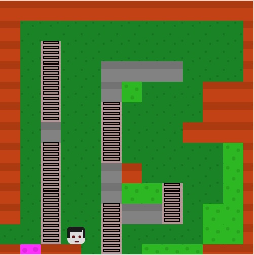

Over the summer I program a game called The Little Homunculus using javascript. This is a basic platformer game, based on former products. The game has an in-compeeet sequel, that I was working on before the semester started.
 
Source: <a href="https://github.com/theVacay/vacay"><i class="large github icon"></i>theVacay/vacay</a>
